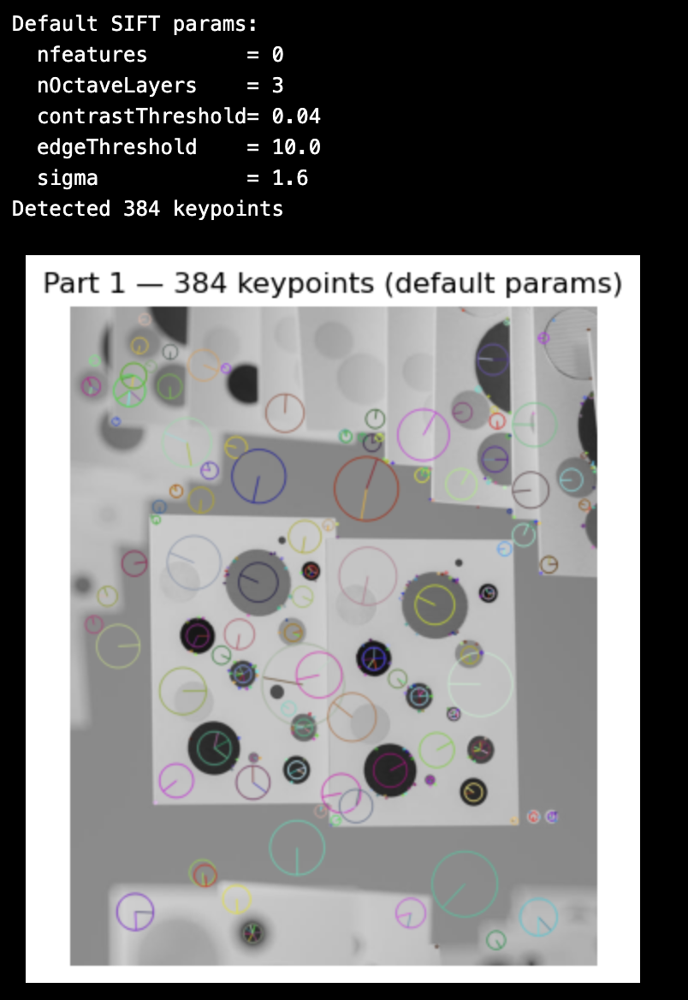
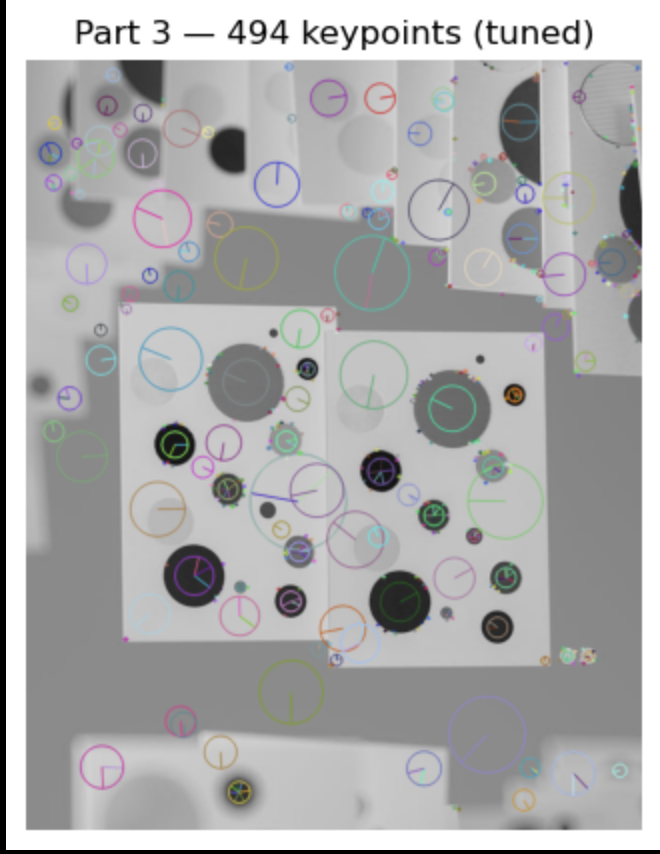
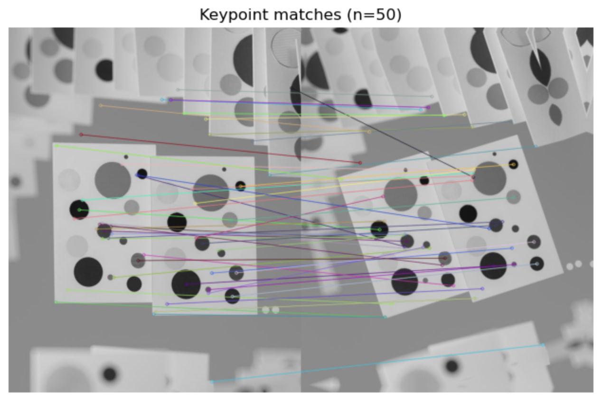

Molly Myers Repo3

1. Visualization showing keypoints with scale-proportional circles in image1 

2. Comparison of keypoint detection between the default thresholds and your tuned thresholds, including the explanation of the difference.
I added sliders for each of the different feautures. This made it easier for me to visualize. The lower contrastThreshhold let in more real circles and fewer weak points. Tuning gave better circle coverage with a small increase in weak points. 

3. Visualization and explanation of descriptor.

My shape was (494, 128) so each keypoint has a 128-D vecotr. I also plotted a histogram. 

4. Visualization of successful keypoint matches between image1 and image2.

The figure shows mostly consistent lines connecting corresponding circular features across the two images. But, a few outliers appear due to low-contrast patterns