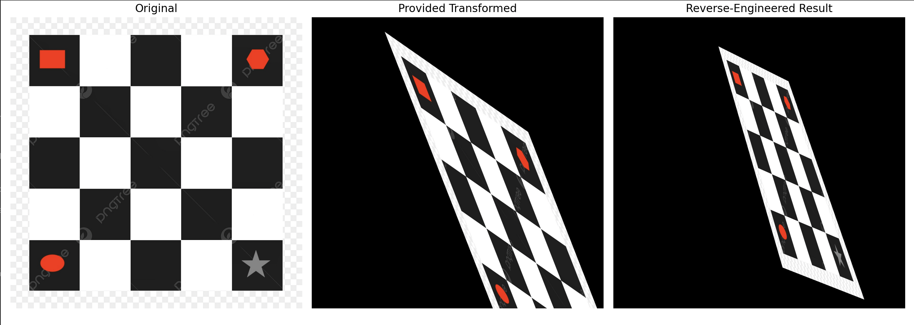
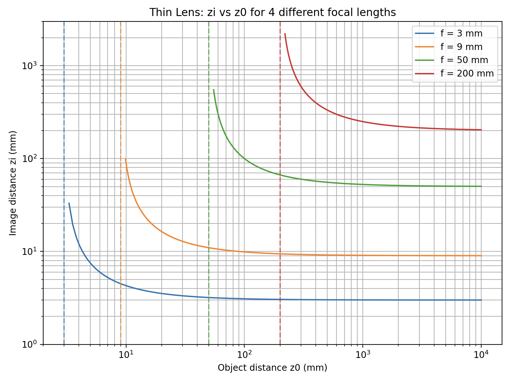
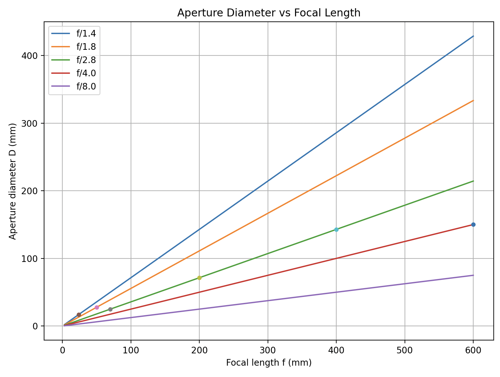
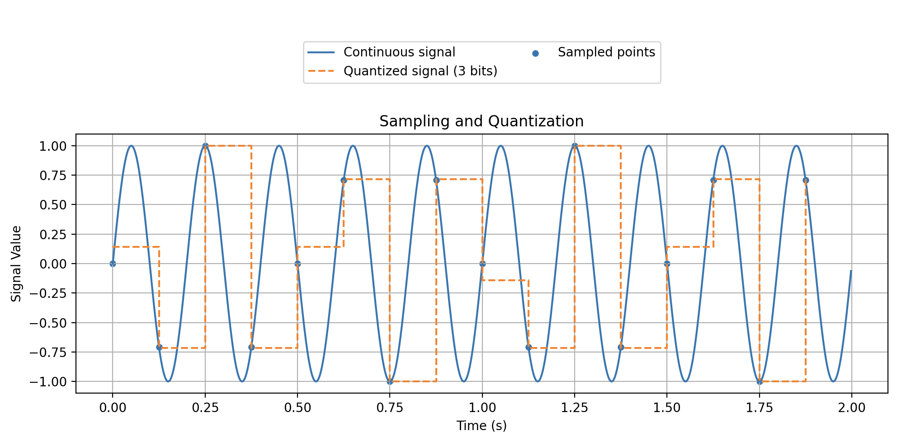
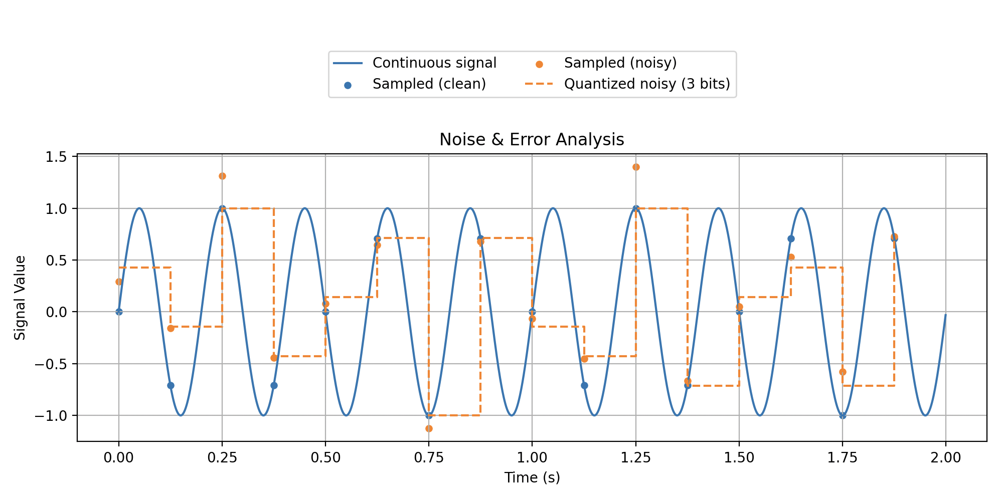

# Molly Myers
Repository 1
CSC 391

*Use command click to open images -- learned how to do this through ChatGPT*

For this project we were asked to code 4 different things. 
The first exercise was geometric_transforms.py where we needed to take an image and reverse engineer a transformed result. I used 2D transformations to the original image in order to get as close as I could to the taget photo (transformed_image.jpg). Additionally at the end we needed to print the transformations that were applied to the console.

The second exercise was lens_aperture_params.py where we needed to accomplish two different things. For the first graph we needed to plot the lens-to-image distance as a function of the object distance at four different focal lengths (f) (3mm, 9mm, 50mm, and 200mm). There needed to be a plotted curve and a vertical dashed line at each focal length at z0 = f.  The second part was to plot the aperture diameter as a function of the focal length for 5 f-numbers (24mm, 50mm, 70-200mm, 400mm, and 600mm). I printed the required aperture diameters for each lens for the stated f-number to the console and added the points to the graph. 

The third exercise was sampling_quantization.py where we needed to take a continuous signal and convert it into a digital one. We showed this on a staircase plot so we could show the quantized levels based on time intervals.
Discussion Questions: 
What do you think a reasonable sampling frequency should be to capture the true shape of the signal? 
- Sample way above Nyquist. So for this 5 Hz sine we should use something like 5*5 instead of 5*2. So 25 Hz instead of 10 Hz. 
What should be done to minimize error? 
- you should increase the sampling rate, prevent aliasing, and use more bits.

And the fourth exercise was error_noise_analysis.py where we modeled noise by adding a Gaussian random singal and observed the effects in the captured signal. At the end I computed and printed the mean square error (MSE), the root mean square error (RMSE), and the peak signal-to-noise ratio (PSNR) to the console. 
