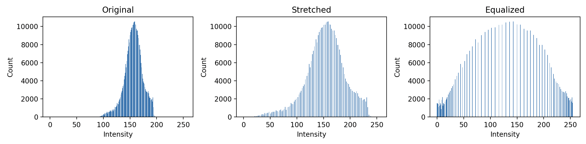
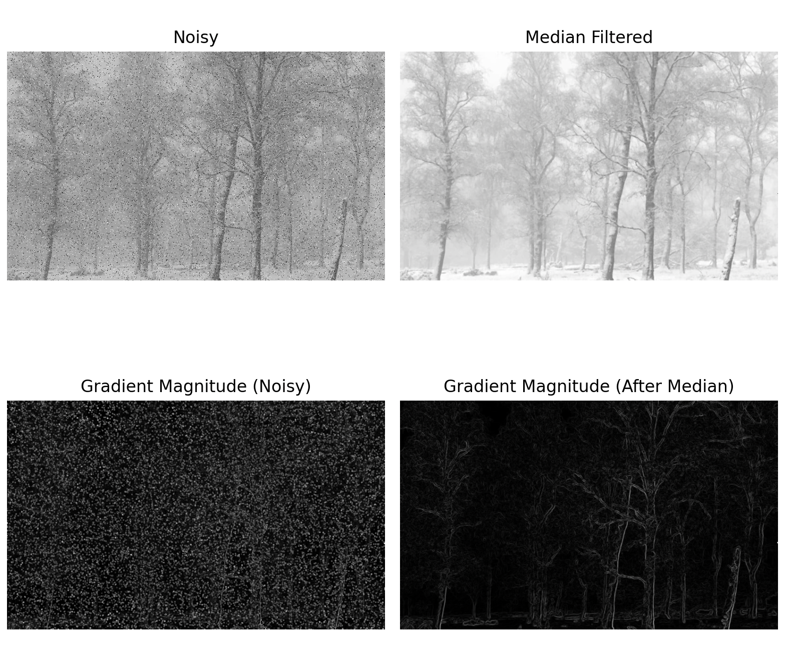
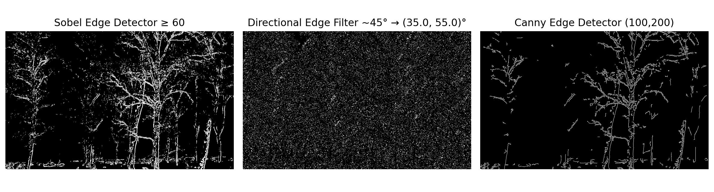

Repository2 - Myers

Added a new class to run each part so it would be more clean. Hope that this is okay. I have added how to run each part below. 

Part1:
to run -- python3 Part1_Histograms.py
Plots the original, stretched, and equalized histograms of the low contrast photo next to each other. 
Plots saved in p1_hist_summary.png

Part2:
to run -- python3 Part2_FilterandEdge.py
Displays the low contrast image with 4 different computations. Noisy results, Median Filtered results, Noisy Gradient Magnitude results, and After Median Gradient Magnitude Results. 
Data returned to console and altered images saved to p2_summary.png

Part3:
to run -- python3 Part3_SobelEdge
Displays 3 images: an edge map based on gradient magnitude only, edges that are roughly 45 degrees, and one using the Canny edge detection algorithm. 
Data returned to console and altered images saved to p3_summary.png

